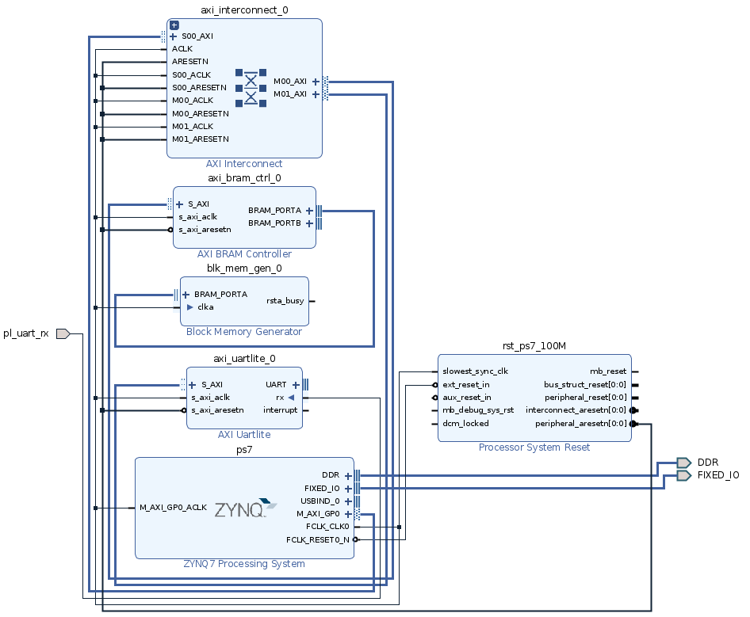
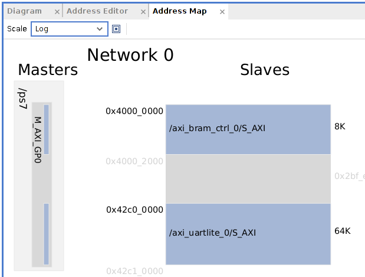
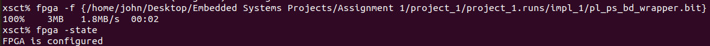
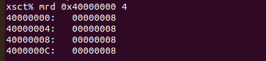
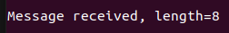

# From FPGA (PL) to CPU (PS): Message Passing via BRAM

A Zynq-7000 design on a PYNQ-Z2 board where the programmable logic (PL) writes a message into on-chip block RAM and a bare-metal application on the processing system (PS) polls that memory, reads the message back, and prints it over the PS UART console. Assignment for the Embedded Systems course, SDU.



## At a glance

| | |
|---|---|
| **Board** | PYNQ-Z2 (Zynq-7020, dual Cortex-A9) |
| **PL side** | AXI Interconnect + AXI BRAM Controller + Block Memory Generator, mapped at `0x40000000` (8 KiB window); AXI UARTLite also present in the design |
| **PS side** | Bare-metal Vitis application that polls the BRAM length word and prints the payload via `xil_printf` over the PS UART |
| **Message format** | First 32-bit word at the BRAM base = payload length; payload bytes follow immediately after |
| **Bring-up** | XSCT: `ps7_init` → FSBL → program bitstream → enable PS↔PL level shifters → map the PL window → run the app |
| **Simulation** | A separate Icarus Verilog testbench suite validates a custom UART→BRAM receiver model against 4 scenarios (zero-length, normal, truncated, oversized payloads), with a CI script |

## How it works

The ZYNQ7 Processing System's `M_AXI_GP0` master port reaches into PL address space through an AXI Interconnect and an AXI BRAM Controller, which — paired with a Block Memory Generator — implements a small block of on-chip memory addressable from the PS. That memory is mapped at `0x40000000` with an 8 KiB window, and the first 32-bit word is used as a "length" field: a producer in the PL writes a message and sets the length, and the PS polls that field to know when a message is ready.

An AXI UARTLite core is present in the block design as a PL-side memory-mapped UART, but the working end-to-end demo instead used an external UMFT234XD USB-to-UART adapter wired directly into a PL input pin (`pl_uart_rx`, PMOD B / package pin `W14`, 3.3V TTL) as the message producer — UARTLite is left in the design as groundwork for a future iteration. A Processor System Reset block keeps the AXI-attached PL peripherals in reset until it's released in a controlled, clock-synchronous sequence.

The PS application (`src/ps_app/main.c`) is a simple bare-metal polling loop: read the length word, and if it's nonzero, read that many bytes out of BRAM in chunks, print them, then clear the length word to acknowledge the message.



## Bring-up sequence

Getting the PS to reliably see the PL memory window was the trickiest part — solved with an XSCT sequence that: connects to the hardware server, sources `ps7_init` and runs the FSBL to bring up DDR and PS subsystems, programs the bitstream, calls `ps7_post_config` and enables the PS↔PL level shifters, explicitly registers the `0x40000000` window with `memmap` (to stop XSCT from treating PL reads as invalid), and only then downloads and runs the application ELF.

 

## Results

With the bring-up sequence complete, writing a length + payload into BRAM (either from XSCT directly or via the external UART) reliably produced the expected output on the PS UART console — confirming the full PL→BRAM→PS data path.



[Watch the demo](https://youtu.be/W6VeNONTLzI) (also included locally at `assets/demo.webm`) — the left side shows the commands being run in order with explanations, the right side is the PS UART console receiving the message.

## Simulation

Separately from the hardware demo, `src/sim/` contains a behavioral model of a custom PL UART→BRAM receiver (`pl_uart_receiver.v`) together with an Icarus Verilog testbench suite (`pl_uart_tb_multi.v`) covering four scenarios: a zero-length message, a normal payload, a truncated payload (declared length exceeds what's actually sent), and an oversized payload (clamped to the model's capacity). `run_ci.sh` compiles and runs the suite and exits non-zero on any failure; `run_xsim.tcl` runs the same tests inside Vivado's XSIM. See `src/sim/TESTS.md` for the full breakdown of what each test checks. This models the message-passing behavior in isolation from the vendor UARTLite IP that the real hardware design also includes.

## Repository structure

```
From FPGA (PL) to CPU (PS)/
├── README.md
├── src/
│   ├── ps_app/                  bare-metal PS application (Vitis)
│   │   ├── main.c
│   │   ├── platform.h
│   │   └── xil_printf.h
│   └── sim/                     PL UART→BRAM receiver model + testbenches
│       ├── pl_uart_receiver.v
│       ├── pl_uart_tb.v
│       ├── pl_uart_tb_multi.v
│       ├── run_ci.sh / run_sim.sh / run_sim_multi.sh / run_xsim.tcl
│       └── TESTS.md
├── vivado/                      Vivado project sources (Vivado 2020.2)
│   ├── project_1.xpr
│   ├── constrs_1/pl_uart.xdc    PMOD B pin constraint for pl_uart_rx
│   ├── bd/pl_ps_bd/             block design (ps7, AXI interconnect, BRAM ctrl, UARTLite, reset)
│   ├── scripts/                 create_bd.tcl / build_bitstream.tcl+sh
│   ├── pl_ps_bd_wrapper.xsa     exported hardware for Vitis
│   └── pl_ps_bd_wrapper.bit     built bitstream
├── assets/                      screenshots + demo video
└── docs/
    └── Embedded_Systems_Assignment1.pdf   full report
```

## Running it

1. Open `vivado/project_1.xpr` in Vivado 2020.2 (or regenerate the block design from `vivado/scripts/create_bd.tcl`), validate it, generate a bitstream, and export hardware (or use the included `vivado/pl_ps_bd_wrapper.xsa` / `.bit` directly).
2. In Vitis, create a platform from the exported XSA and import `src/ps_app/` as a bare-metal application; update `BRAM_BASE_ADDR` in `main.c` if your Address Editor assigns a different address.
3. Bring up the board over XSCT: run `ps7_init`, download and run the FSBL, program the bitstream, call `ps7_post_config`, enable the PS↔PL level shifters, `memmap` the BRAM window, then download and run the application.
4. Write a length + payload into BRAM (from XSCT with `mwr`, or by sending bytes into `pl_uart_rx` from an external UART adapter) and watch the PS UART console print the message.
5. To run the simulation test suite instead: `cd src/sim && ./run_ci.sh`.

## Tools & technology

Xilinx Vivado 2020.2 (block design, AXI Interconnect, AXI BRAM Controller, AXI UARTLite), Xilinx Vitis (bare-metal C), XSCT, Icarus Verilog, PYNQ-Z2 (Zynq-7020), UMFT234XD USB-to-UART adapter.

## Skills demonstrated

Zynq PS↔PL integration with AXI, on-chip memory-mapped message passing, hardware bring-up and debugging via XSCT (including PS↔PL level shifters and memory-map registration), bare-metal embedded C, Verilog testbench design with automated pass/fail reporting and CI scripting.
